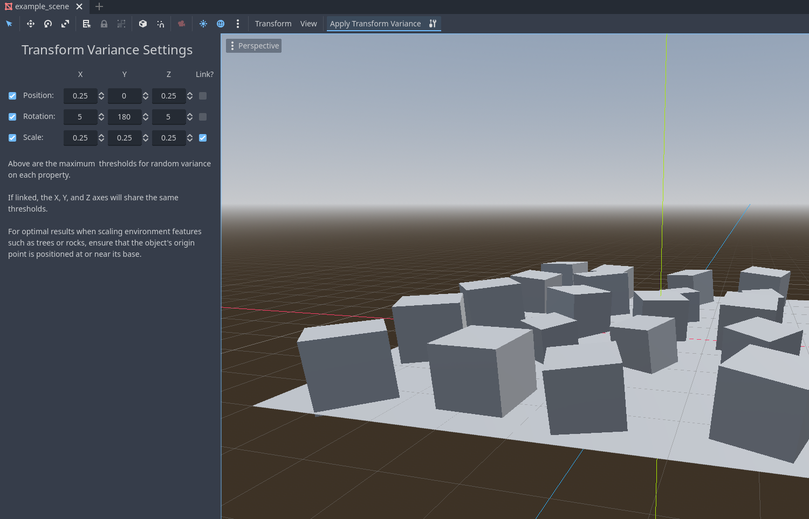

# Transform Variance

Transform Variance is a plugin for the Godot game engine that provides a convenient way to apply random variance to the position, rotation, and scale of selected Node3Ds based on user-defined parameters.

This plugin is useful for decorating scenes with multiple instances of the same assets without the need to manually adjust each one individually.

## Usage

Once the plugin is enabled, simply select one or multiple Node3Ds in the editor. Buttons for applying and configuring transform variance will appear in the editor's menu.

In the settings panel, you have the flexibility to set maximum thresholds for the random variance on each axis for each property. Additionally, you can link multiple axes together and choose which properties will be affected by the transformation.

For optimal results when scaling environment features such as trees or rocks, ensure that the object's origin point is positioned at or near its base.

## Installation

Copy the "addons" folder into your Godot project's root directory and enable the plugin in "Project Settings/Plugins."
